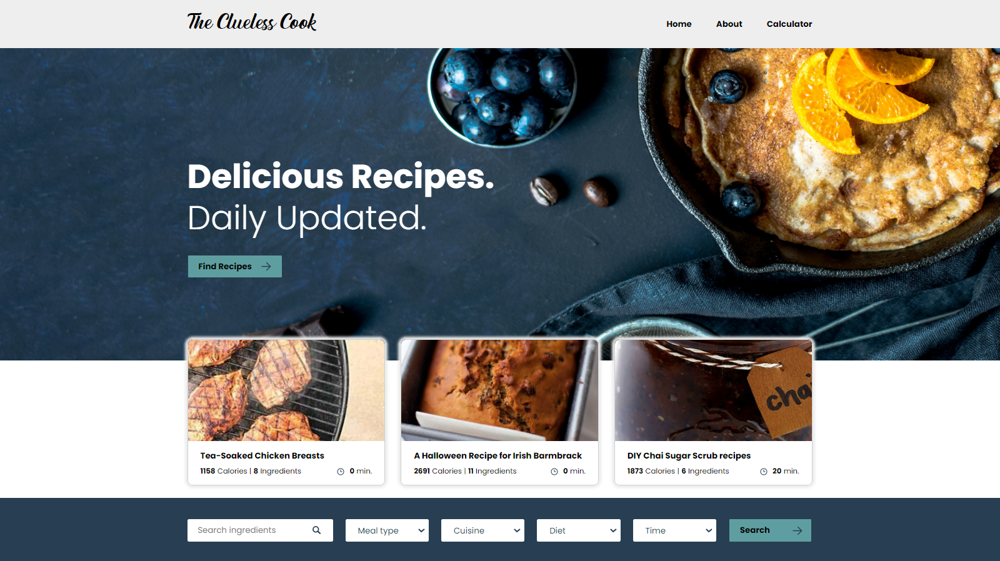

# my-eindopdracht-webdevelopment-sb

Do you never know what to cook tonight? And then when you've found a recipe, you are so curious what the nutritional values ​​are? Or are you in the supermarket and wondering how many calories does an ingredient have?

`The Clueless Cook` web application will answer all these question for you! 

## Requirements
* Edamam food database API KEY
* Node.js

## Getting started
* npm install
* npm start
* Go to http://localhost:1234 to view the app
